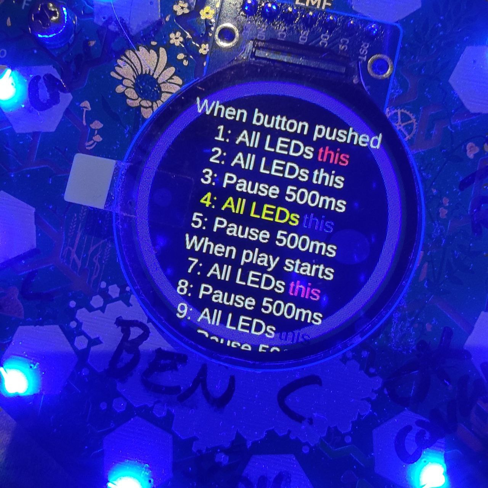

# Sequencer



## Install

```
mpremote fs mkdir /apps/sequencer
mpremote fs cp app.py :/apps/sequencer/
```

## Play mode

When you first load the app, it will load a default program and start
playing.

Play mode is indicated by a green ring around the edge of the screen.

Press CANCEL (top left) button to stop the program and go into edit mode.

## Edit mode

Edit mode is indicated by a blue ring around the edge of the screen.

CANCEL will exit the app.

UP/DOWN will scroll through the default program.

CONFIRM will bring up a menu of things you can do, either to the current
step or to the program as a whole.

You can:

* delete steps
* add steps
* play the program

## The default program

The default program will trigger a sequence of LED flashes. Then it will
wait for any button to be pressed and do some more flashing every time
that happens.
